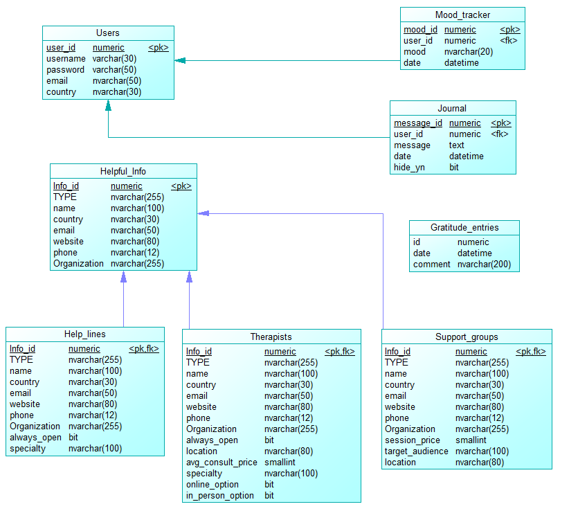

# Squeak To Speak

## 1. Project Overview

- **Company Name**: Squeak to Speak
- **Group 11**: Joana Sanches, Margarida Sardinha, Margarida Marchão, Maria Santos, Renato Bernardino
- **Description**:  
  Squeak to Speak revolutionizes access to mental health resources through conversational AI that provides personalized and context-based recommendations. By including LLM technology, the AI assistant continuously adapts to user needs and preferences, creating a personalized and adaptable support path that encourages emotional growth and helps users connect with the most suitable mental health resources. This approach ensures a comfortable journey toward emotional well-being, making it easier for users to find the right support while also ensuring the effective use of human psychological resources.
---

## 2. How to Test the Chatbot

### 2.1 Prerequisites

- **Python Version**: 3.10.11
- **Dependencies**:  
  List all the required libraries and frameworks.
- **Environment Setup**:  
  Instructions for setting up the environment, such as creating a virtual environment or conda environment.

### 2.2 How to Run the Chatbot

Provide a clear, step-by-step guide on how to launch and interact with the chatbot. Include any necessary commands, parameters, or configurations. Groups should provide information of an existing user so i can test the chatbot using information of that user, i will also test the registration process.

## 3. Database Schema

### 3.1 Database Overview and Schema Diagram
This is the database operating behind the chatbot.



### 3.2 Table Descriptions

__Users Table__ :
General info on each of the users. Required for sign in and basic operations.

- user_id: Numeric (Primary Key) - Unique identifier for a user. 
- username: Varchar(30) - The username of the user.
- password: Varchar(50) - The user's password.
- email: Nvarchar(50) - The user's email address.
- country: Nvarchar(30) - The user's country.

__Mood_tracker Table__ :
Mood tracker entries made by the users. Each entry corresponds to the daily mood of the user

- mood_id: Numeric (Primary Key) - Unique identifier for each mood tracking entry.
- user_id: Numeric (Foreign Key) - Reference to the user who created the entry.
- mood: Nvarchar(20) - The recorded mood 
- date: Datetime - Date of the mood entry.
- description: Text - Additional details or description of the mood.

__Journal Table__ :
Journal entries made by the users. Being "hiden" means that the message will not be used by the chatbot unless told so

- message_id: Numeric (Primary Key) - Unique identifier for each journal entry.
- user_id: Numeric (Foreign Key) - Reference to the user who wrote the journal entry.
- message: Text - Content of the journal entry.
- date: Datetime - Date of the journal entry.
- hide_yn: Bit - Indicates whether the journal entry is hidden (Boolean).
- time: Datetime - Time of the journal entry.
- Gratitude_entries Table
- id: Numeric (Primary Key) - Unique identifier for each gratitude entry.
- date: Datetime - Date of the gratitude entry.
- comment: Nvarchar(200) - Content of the gratitude entry.

__Helpful_Info Table__:
Mother table to the various types of information the chatbot may give out. Subdivides into Help_lines, Therapists and Support_groups

- Info_id: Numeric (Primary Key) - Unique identifier for helpful information entries.
- TYPE: Nvarchar(255) - Type of information (e.g., helpline, therapist, support group).
- name: Nvarchar(100) - Name of the resource.
- country: Nvarchar(30) - Country of the resource.
- email: Nvarchar(50) - Email address of the resource.
- website: Nvarchar(80) - Website of the resource.
- phone: Nvarchar(12) - Phone number of the resource.
- Organization: Nvarchar(255) - Name of the associated organization.

__Help_lines Table (Subtype of Helpful_Info)__
- always_open: Bit - Indicates if the helpline operates 24/7 (Boolean).
- specialty: Nvarchar(100) - Focus or specialty of the helpline (e.g., mental health, crisis).

__Therapists Table (Subtype of Helpful_Info)__
- always_open: Bit - Indicates if the therapist provides 24/7 services (Boolean).
- location: Nvarchar(80) - Location of the therapist's office.
- avg_consult_price: Smallint - Average consultation price of the therapist.
- specialty: Nvarchar(100) - Focus or specialty of the therapist (e.g., CBT, trauma).
- online_option: Bit - Indicates if online consultations are available (Boolean).
- in_person_option: Bit - Indicates if in-person consultations are available (Boolean).

__Support_groups Table (Subtype of Helpful_Info)__
- session_price: Smallint - Price of group sessions.
- target_audience: Nvarchar(100) - Intended audience of the support group (e.g., teens, veterans).
- location: Nvarchar(80) - Location of the support group sessions.


## 4. User Intentions

### 4.1 Implemented Intentions

List and briefly describe the user intentions that the chatbot is designed to handle. For example:

**1: I want a recommendation for a healthcare professional**:
**2: I want to know about support groups in my area**:
**3: I want a contact for an emergency or non-emergency hotline**:
**4: I want an alternative to a habit I have**:
**5: I want to make an entry in my journal or mood board**:
**6: I want to see my journal or mood board**:
**7: I want to make an entry on the community gratitude banner**:
**8: I want to know more about Squeak to Speak mission and values**:
**9: I want to know what Squeak and Speak can do for me**:
**10: I want to know what Squeak and Speak knows about me**:
**11: I want to delete data from my Journal or Mood Board**:
**12: I want to alter data on my Journal or Mood Board**:
**13: I want to talk to the Chatbot having the knowledge of what I wrote in my journal**:


### 4.2 How to Test Each Intention

For each intention, provide 3 examples of test messages that users can use to verify the chatbot's functionality. Include both typical and edge-case inputs to ensure the chatbot handles various scenarios.

#### Product Information

**Test Messages:**

1. "Tell me about the latest phone models."
2. "Give me more details about the tablet in your store."
3. "What products do you offer in the electronics section?"

**Expected Behavior:**  
The chatbot should retrieve and present information about the specific product or category the user is inquiring about.

---

## 5. Intention Router

### 5.1 Intention Router Implementation

- **Message Generation**:  
  Describe how you generated messages for each user intention. Did you create the messages manually, use synthetic data, or leverage a dataset? Specify the method used and tools/scripts for generating the data.  
  Where are the generated messages stored (e.g., in a file, database, or another format)?

### 5.2 Semantic Router Training

- **Hyperparameters**:  
  Report which encoder was used in the semantic router.  
  Report the aggregation method and the `top_k` parameter used for selecting the most relevant results.

### 5.3 Post-Processing for Accuracy Improvement

- **Post-Processing Techniques**:  
  If you applied any post-processing techniques to enhance the router's accuracy, describe them here.  
  For example, did you use a Large Language Model (LLM) for additional refinement?  
  Explain how these techniques were integrated into the pipeline and any custom code or algorithms used.

---

## 6. Intention Router Accuracy Testing Results

### Methodology

1. **Message Creation**:

   - Generate at least 50 messages per intention, totaling 400 messages. These can be either synthetic or human-generated.
   - Additionally, generate at least 25 small-talk messages related to your company and 25 off-topic messages unrelated to the company, labeled as "None."

2. **Data Splitting**:

   - Split the dataset into training and testing sets (90/10), ensuring a balanced distribution of each intention across both sets.

3. **Training the Semantic Router**:

   - Use the training split to train the semantic router. Report the accuracy on both the training and testing splits.

4. **Post-Processing with LLM**:

   - If applicable, apply post-processing using an LLM to improve the accuracy of the router. Report accuracy on both the training and testing splits after post-processing.

5. **Reporting Results**:
   - Report the accuracy for each intention, as well as the overall accuracy. Accuracy should be calculated as the percentage of correct responses out of the total inputs for each intention.

### Results

Present the accuracy results in a table format:

| Intention            | Test Inputs | Correct | Incorrect | Accuracy (%) |
| -------------------- | ----------- | ------- | --------- | ------------ |
| Product Information  | 10          | 9       | 1         | 90%          |
| Order Status         | 10          | 8       | 2         | 80%          |
| Create Order         | 10          | 7       | 3         | 70%          |
| **Average Accuracy** | 30          | 24      | 6         | 80%          |

```

```
