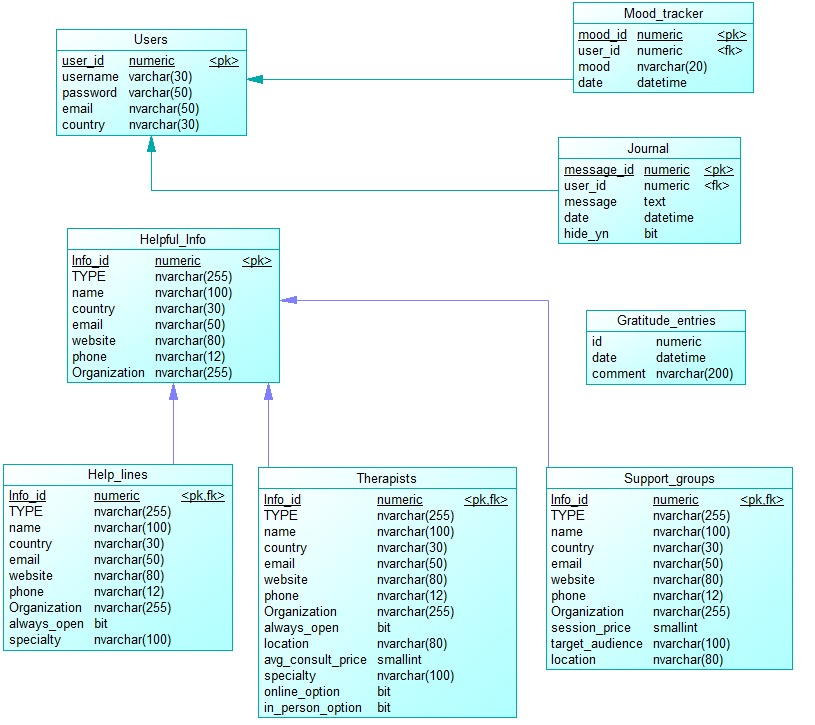

  # Squeak To Speak

  ## 1. Project Overview

  - **Company Name**: Squeak to Speak
  - **Group 11**: Joana Sanches, Margarida Sardinha, Margarida Marchão, Maria Santos, Renato Bernardino
  - **Description**:  
    Squeak to Speak revolutionizes access to mental health resources through conversational AI that provides personalized and context-based recommendations. By including LLM technology, the AI assistant continuously adapts to user needs and preferences, creating a personalized and adaptable support path that encourages emotional growth and helps users connect with the most suitable mental health resources. This approach ensures a comfortable journey toward emotional well-being, making it easier for users to find the right support while also ensuring the effective use of human psychological resources.
  ---

  ## 2. How to Test the Chatbot

  ### 2.1 Prerequisites

  - **Python Version**: 3.10.11
  - **Dependencies**:  
    Found also in requirements.txt
    
    - langchain v.0.3.9
    - langchain-openai v.0.2.10
    - openai v.1.55.3
    - pandas v.2.2.3
    - pydantic v.2.10.2
    - python-dotenv v.1.0.1
    - streamlit v.1.40.2
    - torch v.2.5.1
    - transformers v.4.46.3
    - langchain-pinecone v.0.2.0
    - pinecone-client v.5.0.1
    - semantic-router v.0.0.72
    - langchain-community v.0.3.4
    - python-dotenv v.1.0.1

  - **Environment Setup**:
To set up your environment for testing the chatbot, follow these steps:

  *Option 1: Using venv (virtual environment)*
  1. Create a virtual environment:
      python3 -m venv squeak-to-speak-env

  2. Activate the virtual environment:
     
    - On Windows:
      squeak-to-speak-env\Scripts\activate

    - On macOS/Linux:
      source squeak-to-speak-env/bin/activate

  3. Install dependencies: Ensure that requirements.txt is available in the root of your repository and install the necessary packages by running:
  
    pip install -r requirements.txt


  *Option 2: Using Conda Environment*
  1. Create a conda environment:
     
    conda create --name squeak-to-speak python=3.10.11

  3. Activate the environment:

    conda activate squeak-to-speak
  
  5. Install dependencies:

    pip install -r requirements.txt


### 2.2 How to Run the Chatbot

Once the environment is set up, you can run the chatbot locally as explained below.

1. Run the Streamlit app by typing in the terminal:

    streamlit run app.py

The app will start, and you can open your browser to http://localhost:8501 to interact with the Squeak to Speak chatbot.

2. Log in to the platform, by browsing to the Login page. 
The user account for testing is the following:
*username* - *password*


## 3. Database Schema

### 3.1 Database Overview and Schema Diagram
This is the database operating behind the chatbot.



### 3.2 Table Descriptions

__Users Table__ :
General info on each of the users. Required for sign in and basic operations.

- user_id: Numeric (Primary Key) - Unique identifier for a user. 
- username: Varchar(30) - The username of the user.
- password: Varchar(50) - The user's password.
- email: Nvarchar(50) - The user's email address.
- country: Nvarchar(30) - The user's country.

__Mood_tracker Table__ :
Mood tracker entries made by the users. Each entry corresponds to the daily mood of the user

- mood_id: Numeric (Primary Key) - Unique identifier for each mood tracking entry.
- user_id: Numeric (Foreign Key) - Reference to the user who created the entry.
- mood: Nvarchar(20) - The recorded mood 
- date: Datetime - Date of the mood entry.

__Journal Table__ :
Journal entries made by the users. Being "hiden" means that the message will not be used by the chatbot unless told so

- message_id: Numeric (Primary Key) - Unique identifier for each journal entry.
- user_id: Numeric (Foreign Key) - Reference to the user who wrote the journal entry.
- message: Text - Content of the journal entry.
- date: Datetime - Date of the journal entry.
- hide_yn: Bit - Indicates whether the journal entry is hidden (Boolean).
  
__Gratitude_entries Table__ :
Gratitude quotes written by the users, to be shown in a rolling banner to all users.

- id: Numeric (Primary Key) - Unique identifier for each gratitude entry.
- date: Datetime - Date of the gratitude entry.
- comment: Nvarchar(200) - Content of the gratitude entry.

__Helpful_Info Table__:
Mother table to the various types of information the chatbot may give out. Subdivides into Help_lines, Therapists and Support_groups

- Info_id: Numeric (Primary Key) - Unique identifier for helpful information entries.
- TYPE: Nvarchar(255) - Type of information (e.g., helpline, therapist, support group).
- name: Nvarchar(100) - Name of the resource.
- country: Nvarchar(30) - Country of the resource.
- email: Nvarchar(50) - Email address of the resource.
- website: Nvarchar(80) - Website of the resource.
- phone: Nvarchar(12) - Phone number of the resource.
- Organization: Nvarchar(255) - Name of the associated organization.

__Help_lines Table (Subtype of Helpful_Info)__
- always_open: Bit - Indicates if the helpline operates 24/7 (Boolean).
- specialty: Nvarchar(100) - Focus or specialty of the helpline (e.g., mental health, crisis).

__Therapists Table (Subtype of Helpful_Info)__
- always_open: Bit - Indicates if the therapist provides 24/7 services (Boolean).
- location: Nvarchar(80) - Location of the therapist's office.
- avg_consult_price: Smallint - Average consultation price of the therapist.
- specialty: Nvarchar(100) - Focus or specialty of the therapist (e.g., CBT, trauma).
- online_option: Bit - Indicates if online consultations are available (Boolean).
- in_person_option: Bit - Indicates if in-person consultations are available (Boolean).

__Support_groups Table (Subtype of Helpful_Info)__
- session_price: Smallint - Price of group sessions.
- target_audience: Nvarchar(100) - Intended audience of the support group (e.g., teens, veterans).
- location: Nvarchar(80) - Location of the support group sessions.


**Expected Behavior:**  
The chatbot should recall relevant journal or mood board entries and use that knowledge to provide personalized and empathetic responses.

## 4. User Intentions

### 4.1 Implemented Intentions

**1: I want a recommendation for a healthcare professional**

Using details about the user's mental health needs, preferences, and location, deliver a personalized recommendation for a healthcare professional who matches their needs and preferences.

**2: I want to find support groups in my vicinity**

Provide information about support groups that match the user's specified criteria and location.

**3: I want to access the contact information for emergency or non-emergency hotlines**

Provide the contact information for the requested hotline, including any relevant details such as availability and services offered.

**4: I want to find a healthier or more sustainable alternative to a habit I currently have**

Suggest healthier or more sustainable alternatives to the user's current habit, including any relevant tips or resources.

**5: I want to record my thoughts, feelings, or reflections by making an entry in my journal or mood board**

Record the user's entry in their journal or mood board, including any relevant details such as date and time.

**6: I want to contribute a message of gratitude or positivity to the community gratitude banner**

Record the user's message of gratitude or positivity and display it on the community gratitude banner.

**7: I want to learn about the mission, vision, and values of Squeak to Speak**

Provide information about the mission, vision, and values of Squeak to Speak.

**8: I want an overview of the features and functionalities of Squeak to Speak**

Provide an overview of the features and functionalities of Squeak to Speak.

**9: I want to review the data that Squeak to Speak has collected about me**

Provide a summary of the data that Squeak to Speak has collected about the user, including any relevant details such as journal entries and mood board entries.

**10: I want to modify an existing entry in my journal or mood board**

Allow the user to modify an existing entry in their journal or mood board, including any relevant details such as date and time.

**11: I want to view past entries in my journal**

Display the user's past journal entries, including any relevant details such as date and time.

**12: I want to view past entries in my mood board**

Display the user's past mood board entries, including any relevant details such as date and time.

**13: I want to delete an existing entry in my journal**

Delete the specified journal entry, including any relevant details such as date and time.

**14: I want to delete an existing entry in my mood board**

Delete the specified mood board entry, including any relevant details such as date and time.

**15: I want to engage in a conversation with the chatbot, leveraging the knowledge of my past journal entries**

Engage in a conversation with the user, leveraging the knowledge of their past journal entries to provide personalized and empathetic responses.

### 4.2 How to Test Each Intention

For each intention, provide 3 examples of test messages that users can use to verify the chatbot's functionality. Include both typical and edge-case inputs to ensure the chatbot handles various scenarios.

#### 1. I want a recommendation for a healthcare professional

**Test Messages:**

1. "Can you recommend a therapist who specializes in anxiety and is based in Lisbon?"
2. "I'm looking for a therapist who can help with both depression and marriage issues. Can you find one?"
3. "I need a healthcare professional who can help me with bipolar disorder. Does the recommendation include online options?"

**Expected Behavior:**  
The chatbot should provide a personalized recommendation for a healthcare professional that fits the user’s specified needs and location, including any relevant options such as online services.

#### 2. I want to find support groups in my vicinity

**Test Messages:**

1. "Are there any support groups for depression?"
2. "I want to join a local support group."
3. "Can you find a support group for addiction?"

**Expected Behavior:**  
The chatbot should provide information about support groups that match the user's specified criteria and location.

#### 3. I want to access the contact information for emergency or non-emergency hotlines

**Test Messages:**

1. "What's the number for the suicide hotline?"
2. "I need an emergency contact for mental health."
3. "Can you give me a hotline for domestic abuse?"

**Expected Behavior:**  
The chatbot should provide the contact information for the requested hotline, including any relevant details such as availability and services offered.

#### 4. I want to find a healthier or more sustainable alternative to a habit I currently have

**Test Messages:**

1. "What's a healthier alternative to smoking?"
2. "I want to stop drinking coffee. Any suggestions?"
3. "How can I replace my junk food habit?"

**Expected Behavior:**  
The chatbot should suggest healthier or more sustainable alternatives to the user's current habit, including any relevant tips or resources.

#### 5. I want to record my thoughts, feelings, or reflections by making an entry in my journal or mood board

**Test Messages:**

1. "I feel happy today."
2. "I'm really stressed out."
3. "Just wanted to note that I'm feeling okay."

**Expected Behavior:**  
The chatbot should record the user's entry in their journal or mood board, including any relevant details such as date and time.

#### 6. I want to contribute a message of gratitude or positivity to the community gratitude banner

**Test Messages:**

1. "Today, I'm grateful for my family."
2. "I'm thankful for the sunny weather."
3. "I appreciate my friends."

**Expected Behavior:**  
The chatbot should record the user's message of gratitude or positivity and display it on the community gratitude banner.

#### 7. I want to learn about the mission, vision, and values of Squeak to Speak

**Test Messages:**

1. "What is the mission of Squeak to Speak?"
2. "Can you tell me about your vision?"
3. "What are the core values of this platform?"

**Expected Behavior:**  
The chatbot should provide information about the mission, vision, and values of Squeak to Speak.

#### 8. I want an overview of the features and functionalities of Squeak to Speak

**Test Messages:**

1. "What features does Squeak to Speak offer?"
2. "Can you list the functionalities of this app?"
3. "What can I do with Squeak to Speak?"

**Expected Behavior:**  
The chatbot should provide an overview of the features and functionalities of Squeak to Speak.

#### 9. I want to review the data that Squeak to Speak has collected about me

**Test Messages:**

1. "What data do you have about me?"
2. "Can I see my past entries?"
3. "Show me the information you've collected."

**Expected Behavior:**  
The chatbot should provide a summary of the data that Squeak to Speak has collected about the user, including any relevant details such as journal entries and mood board entries.

#### 10. I want to modify an existing entry in my journal or mood board

**Test Messages:**

1. "I want to edit my journal entry from yesterday."
2. "Can I update my mood entry?"
3. "Change my gratitude note from last week."

**Expected Behavior:**  
The chatbot should allow the user to modify an existing entry in their journal or mood board, including any relevant details such as date and time.

#### 11. I want to view past entries in my journal

**Test Messages:**

1. "Show me my journal entries."
2. "Can I see my past journal notes?"
3. "I want to read my journal."

**Expected Behavior:**  
The chatbot should display the user's past journal entries, including any relevant details such as date and time.

#### 12. I want to view past entries in my mood board

**Test Messages:**

1. "Show me my mood board entries."
2. "Can I see my past mood notes?"
3. "I want to view my mood board."

**Expected Behavior:**  
The chatbot should display the user's past mood board entries, including any relevant details such as date and time.

#### 13. I want to delete an existing entry in my journal

**Test Messages:**

1. "Delete my journal entry from last week."
2. "Can you remove my journal note?"
3. "I want to delete my journal entry."

**Expected Behavior:**  
The chatbot should delete the specified journal entry, including any relevant details such as date and time.

#### 14. I want to delete an existing entry in my mood board

**Test Messages:**

1. "Delete my mood entry from yesterday."
2. "Can you remove my mood note?"
3. "I want to delete my mood board entry."

**Expected Behavior:**  
The chatbot should delete the specified mood board entry, including any relevant details such as date and time.

#### 15. I want to engage in a conversation with the chatbot, leveraging the knowledge of my past journal entries

**Test Messages:**

1. "Let's talk about my journal entries."
2. "Can we discuss my past journal notes?"
3. "I want to chat about my journal."

**Expected Behavior:**  
The chatbot should engage in a conversation with the user, leveraging the knowledge of their past journal entries to provide personalized and empathetic responses.


## 5. Intention Router

### 5.1 Intention Router Implementation

- **Message Generation**:  
  Messages for each user intention were generated using a combination of synthetic data and manual creation. The synthetic data was generated using a language model (GPT-4) with specific prompts tailored to each user intention. The generated messages are stored in a JSON file named `synthetic_intetions.json`.

### 5.2 Semantic Router Training

- **Hyperparameters**:  
  The encoder used in the semantic router is the `HuggingFaceEncoder`. The aggregation method used is `mean`, and the `top_k` parameter for selecting the most relevant results is set to 5.

### 5.3 Post-Processing for Accuracy Improvement

- **Post-Processing Techniques**:  
  Post-processing techniques were applied to enhance the router's accuracy. A Large Language Model (LLM) was used for additional refinement. These techniques were integrated into the pipeline using custom code and algorithms to ensure the chatbot provides accurate and context-aware responses.

## 6. Training and Evaluation

### 6.1 Training Process

- **Data Preparation**:  
  The synthetic data was loaded from the `synthetic_intetions.json` file and split into training and testing sets using stratified sampling.

- **Training**:  
  The `HuggingFaceEncoder` was initialized and used to create a `RouteLayer` with the defined routes. The router was trained using the training data with a maximum of 500 iterations.

### 6.2 Evaluation

- **Evaluation Metrics**:  
  The router's performance was evaluated using accuracy metrics for each user intention. The evaluation results were printed in a table format, showing the number of test inputs, correct predictions, incorrect predictions, and accuracy percentage for each intention.

- **Overall Accuracy**:  
  The overall accuracy of the router was calculated by summing the total correct predictions and dividing by the total test inputs. The overall accuracy was then printed.

### 6.3 Saving the Router Configuration

- **Saving Configuration**:  
  The trained router configuration was saved to a JSON file named `layer.json` for future use.

By following these steps, the chatbot is able to accurately classify user intentions and provide relevant responses based on the user's input.


## 6. Intention Router Accuracy Testing Results

### Methodology

1. **Message Creation**:

   The messages were generated using a synthetic data generation process. Here is a brief description of how the messages were created:

  - **Synthetic User Messages**: A total of 50 messages were generated for each of the 8 user intentions, resulting in 400 messages. These messages were designed to simulate typical user queries for each intention.

  - **Small-Talk Messages**: At least 25 small-talk messages related to the company were generated. These messages were crafted to mimic casual conversations users might have about the company.

  - **Off-Topic Messages**: Additionally, 25 off-topic messages unrelated to the company were generated and labeled as "None". These messages were included to represent queries that do not pertain to the company's services or products.

  The synthetic messages were created using a combination of prompt templates and language models to ensure they sound natural and relevant to the specified intentions.

2. **Semantic Router Training**:
    - Import Necessary Libraries:

      Libraries such as semantic_router, pandas, and sklearn.model_selection were imported to handle routing, data manipulation, and data splitting.
    
    - Load the Data:

      The synthetic intentions data was loaded from a JSON file into a DataFrame named df_synthetic.
    
    - Extract Features and Labels:

      The features (X_syn) and labels (y_syn) were extracted from the DataFrame. The features are the messages, and the labels are the corresponding intentions.
    
    - Split the Data:

      The dataset was split into training and testing sets using the train_test_split function from the sklearn.model_selection module. The split ratio was 80/20, meaning 80% of the data was used for training, and 20% was used for testing.
      
      The random_state parameter was set to 0 to ensure reproducibility of the split.
    
      Labels with the value "None" were replaced with None to ensure proper handling during training and evaluation.
    
    - Categorize Messages:

      Messages were categorized based on their labels into different lists for each intention.
    
    - Define Routes:

      Routes were defined for each intention using the Route class from semantic_router. Each route included a name, description, and the corresponding messages.

    - Initialize the Route Layer:

      A RouteLayer was initialized with a HuggingFaceEncoder and the defined routes.
    
    - Train the Router:

      The fit method of the RouteLayer was called with the training messages and labels to train the semantic router. The max_iter parameter was set to 500 to specify the maximum number of iterations for training.
    
    - Evaluate the Router:
      The router was evaluated using the test data to calculate the accuracy for each intention and the overall accuracy.

3. **Reporting Results**:

### Results


| Intention              | Test Inputs | Correct | Incorrect | Accuracy (%) |
|------------------------|-------------|---------|-----------|--------------|
| update_journal         | 4           | 4       | 0         | 100.0        |
| find_support_group     | 1           | 1       | 0         | 100.0        |
| ask_features           | 1           | 1       | 0         | 100.0        |
| find_therapist         | 4           | 4       | 0         | 100.0        |
| find_hotline           | 1           | 1       | 0         | 100.0        |
| chat_about_journal     | 2           | 2       | 0         | 100.0        |
| insert_mood            | 1           | 1       | 0         | 100.0        |
| review_user_memory     | 3           | 2       | 1         | 66.67        |
| insert_journal         | 1           | 1       | 0         | 100.0        |
| ask_missionvalues      | 3           | 3       | 0         | 100.0        |
| delete_journal         | 4           | 4       | 0         | 100.0        |
| insert_gratitude       | 3           | 3       | 0         | 100.0        |
| update_mood            | 1           | 1       | 0         | 100.0        |
| delete_mood            | 2           | 2       | 0         | 100.0        |
| habit_alternatives     | 2           | 2       | 0         | 100.0        |
| view_mood              | 2           | 0       | 2         | 0.0          |
| **Average Accuracy**   | 35          | 32      | 3         | 91.43        |

      
```

```
